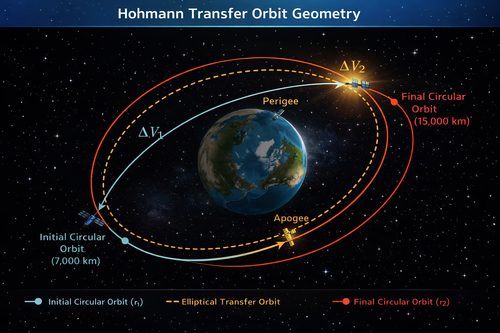
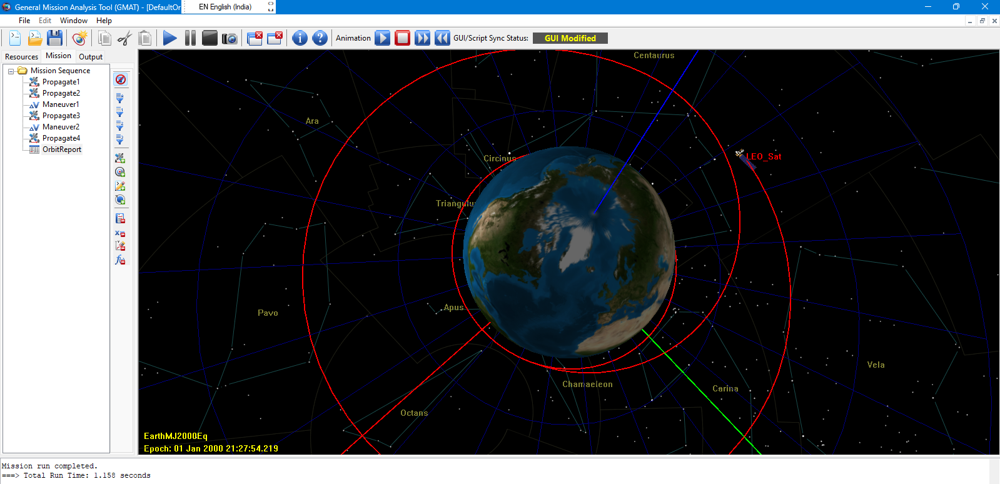
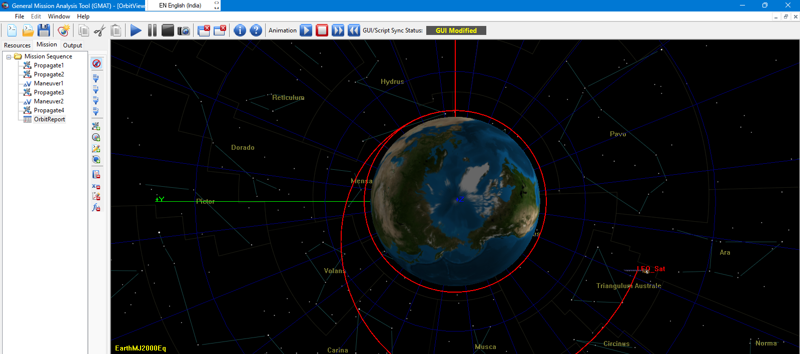
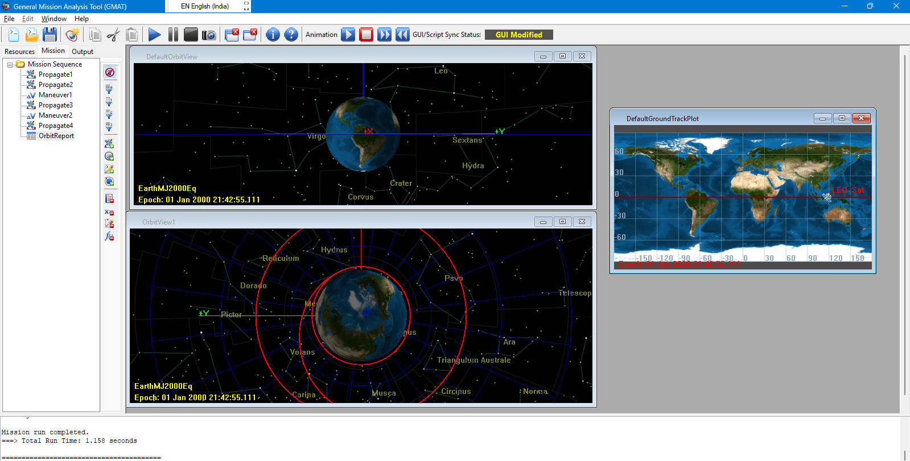
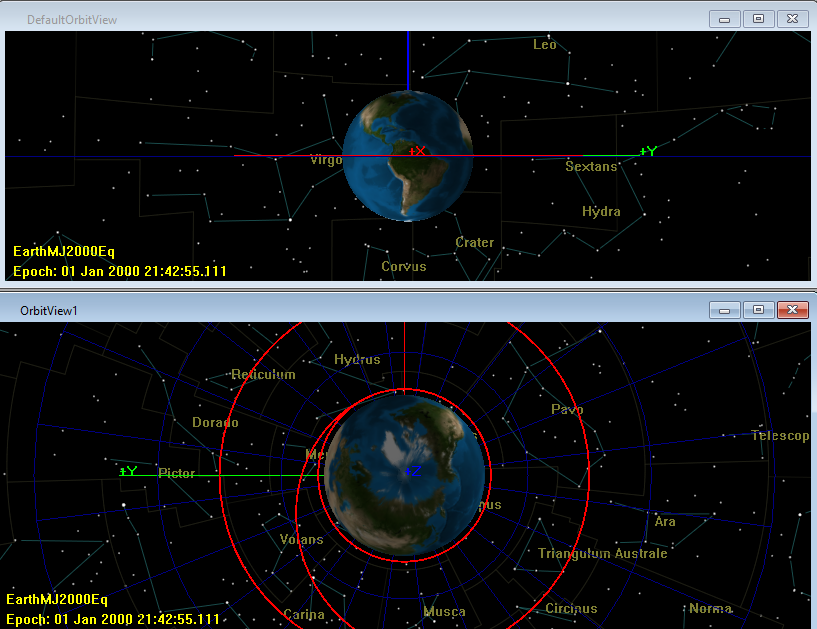
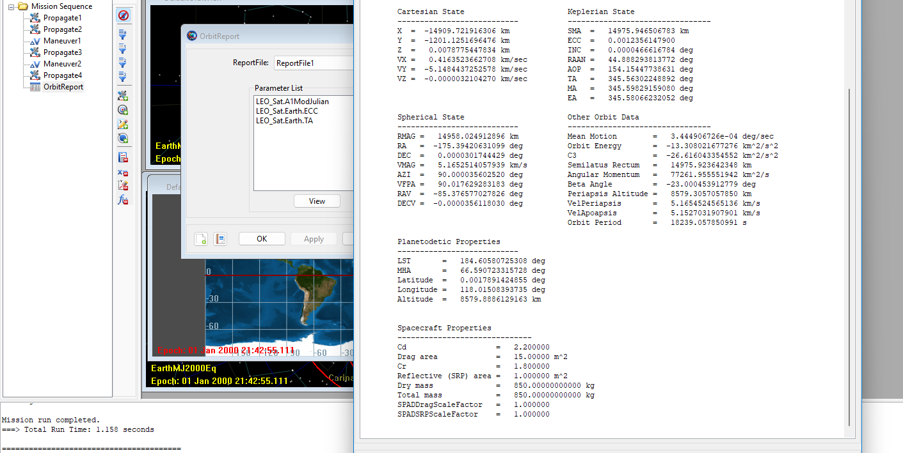

# Hohmann-Transfer-GMAT-Simulation
Simulation and validation of a two-impulse Hohmann transfer using NASA GMAT

  
  
  
  
  

# Orbital Mechanics in Action

## Hohmann Transfer Orbit Simulation using GMAT

 

## Project Overview

This project demonstrates the simulation of a **Hohmann Transfer Orbit** using NASA's General Mission Analysis Tool (GMAT).

The goal of the project is to model and visualize how a satellite transfers from one circular orbit to another using the most fuel-efficient orbital maneuver.

The simulation includes:

• Initial Low Earth Orbit (LEO)  
• Transfer ellipse trajectory  
• Final circular orbit  
• Delta-V maneuver analysis  
• Ground track visualization  

This project helps understand real mission design techniques used in space missions.

---

## Mission Scenario

A satellite initially placed in a **Low Earth Orbit** performs a two-burn maneuver:

1️. First burn: Inject satellite into an elliptical transfer orbit  
2️. Second burn: Circularize orbit at higher altitude

This maneuver minimizes fuel consumption while changing orbital altitude.

---

## Simulation Tool

Simulation performed using:

**NASA GMAT (General Mission Analysis Tool)**

GMAT is widely used for:

• spacecraft trajectory design  
• orbit propagation  
• mission planning  
• satellite maneuver analysis  

---

## Orbital Mechanics Equations

The required velocity changes for the Hohmann transfer are:

ΔV₁ = √( μ / r₁ ) ( √(2r₂ / (r₁ + r₂)) − 1 )

ΔV₂ = √( μ / r₂ ) ( 1 − √(2r₁ / (r₁ + r₂)) )

Where:

μ = Earth's gravitational parameter  
r₁ = initial orbit radius  
r₂ = final orbit radius  

---

## Simulation Results

### Initial Orbit

---

### Transfer Orbit

---

### Final Orbit

---

### Satellite Ground Track Visualization

---

## Repository Structure

---

## Full Technical Article

A complete explanation of this project is published here:

Medium Article

Orbital Mechanics in Action: Building a Hohmann Transfer from Scratch

https://medium.com/@abhijaygopal.s/orbital-mechanics-in-action-building-a-hohmann-transfer-from-scratch-2a346f21af46

---

## Learning Outcomes

Through this project I gained experience in:

• orbital mechanics fundamentals  
• spacecraft maneuver design  
• GMAT mission configuration  
• orbit visualization and analysis  
• scientific documentation

---

## Future Improvements

Possible extensions of this project:

• LEO → GEO transfer simulation  
• inclination change maneuver  
• low-thrust electric propulsion transfer  
• satellite constellation deployment  
• Python integration for orbit analysis

---

## Author

**Abhijay Gopal**

Electrical & Electronics Engineer  
Space & Sustainable Technology Researcher | AI & Cyber Security |  
IEEE MGA Mentor & Leader  

Connect with me:

LinkedIn: https://www.linkedin.com/in/abhijay-gopal-s-72241a1b7/ 

Medium: https://medium.com/@abhijaygopal.s 

GitHub: https://github.com/TheRealAJ-Cypher 

---

## If you found this interesting

Give the repository a **Star** to support the project and Let's work on projects! 
